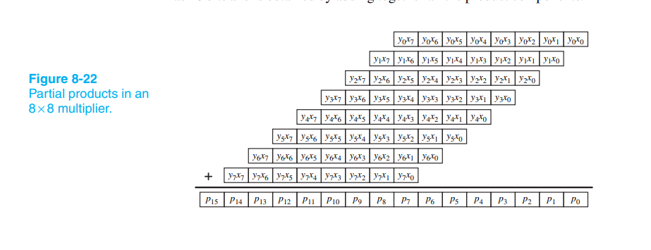
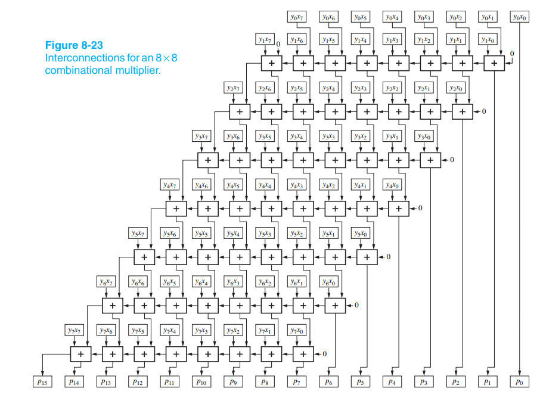
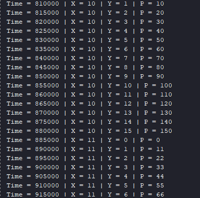
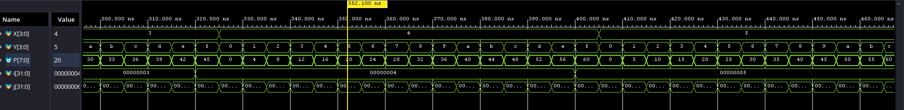

# 4-bit Optimized Combinational Multiplier

## Project Overview
This project features a structural 4-bit x 4-bit hardware multiplier implemented in Verilog. The core arithmetic relies on a combinational array approach, heavily optimized for speed and readability. It focuses on modular instantiation, structural routing over behavioral loops, and the reuse of high-performance Carry Lookahead Adder (CLA) blocks. 

## Literature Reference & Inspiration
The foundational architecture for this design was inspired by the "Multiplying" chapter (pages 416-419) of **"Digital Design Principles and Practices" by John F. Wakerly**.

While Wakerly's textbook uses 8-bit operands for its primary examples, this project scales the design down to 4-bit. This decision was made to maintain consistency with the previously developed 4-bit ALU modules and to keep the gate-level schematics clear and comprehensible. 



## Design Philosophy: Structural vs. Spaghetti Code
A common behavioral approach to writing a multiplier in Verilog involves using 2D arrays (`reg [0:3][3:0]`) and nested `for` loops inside an `always` block, mimicking software programming. While functional, this often results in "spaghetti code" that is difficult to debug at the waveform level and can lead to inefficient hardware synthesis.

This project strictly enforces a **Structural Design Methodology**. Instead of loops, the architecture relies on explicit module instantiations and physical wire routing. Furthermore, to optimize the critical path, the standard Ripple Carry Adders typically found in multiplier arrays were entirely replaced with our previously implemented **4-bit Carry Lookahead Adder (CLA)** IP core, significantly boosting the maximum operating frequency.

For those interested in seeing the code generated by Mr. Wakerly, you can access the `Wakerly_Multiplier.v` module.

## The Mathematical Logic: Digital Column Multiplication
To understand the hardware, we must look at elementary school column multiplication. When multiplying two numbers, we multiply the top number by each digit of the bottom number, writing the results in staggered rows (partial products), and then summing them up.

In the digital world, multiplying a 4-bit multiplicand (X) by a single bit of the multiplier (Y) is achieved using AND gates. The terms y0x0, y0x1, y0x2 represent these elementary boolean multiplications.

### The "Hardware Shift" Concept
In elementary school mathematics, when writing the second row of a multiplication, we shift the number to the left to account for the higher base value, similar to how each row of adders is shifted in the images shown above. 

* **Mathematical Example:** 123 * 456
    * Row 1: 123 * 6 = 738
    * Row 2: 123 * 5 = 615 (Shifted left mathematically: 6150)
    * Sum: 738 + 6150 = 6888

However, in digital hardware, shifting a line to the left means we would need continuously growing adders (e.g., a 5-bit adder, then a 6-bit adder), which wastes fixed silicon area. 

**The Solution:** Instead of shifting the bottom row to the *left*, we drop the Least Significant Bit (LSB) of the top row directly into the final product, and shift the remaining bits of the top row to the *right*. 
**Hardware Example (Fixed Width of 3 digits):**
    * Row 1: 738
    * Row 2: 615
    * *Step 1:* Drop the '8' from Row 1 to the final result.
    * *Step 2:* Shift the rest of Row 1 to the right: 073.
    * *Step 3:* Add the shifted Row 1 to Row 2: 073 + 615 = 688.
    * *Step 4:* Append the dropped '8' to the end: 6888.

The mathematical result is identical, but the hardware can now use standardized, fixed-width components for every stage.

---

## Module-by-Module Code Explanation

### 1. `Partial_Product` Module
This module generates the "rows" of our multiplication table.

```verilog
assign PP0 = X & {4{Y[0]}};
```

Explanation: This line produces the partial products for the first row (y0x0, y0x1, y0x2, y0x3). Because the multiplicand X is 4 bits wide, we use the Verilog replication operator {4{Y[0]}} to copy the Least Significant Bit of Y four times. Applying a bitwise AND between X and this replicated vector dynamically generates the correct values for the entire row. This logic is repeated for PP1, PP2, and PP3 using their respective Y bits.

### 2. `Top_Multiplier` Module
This is the main wrapper that routes the partial products through the adder array.

Declarations:

```verilog
wire [3:0] PP0, PP1, PP2, PP3;
wire [3:0] S1, S2, S3;
wire C1, C2, C3;
```
Explanation: * S1, S2, S3 store the 4-bit intermediate sums generated at each stage of the adder matrix.
C1, C2, C3 capture the 1-bit carry-out ("one in mind") from each adder block, which must be preserved and cascaded into the next stage to maintain mathematical accuracy.

First Bit Extraction:

```verilog
assign P[0] = PP0[0];
```
Explanation: In column multiplication, the very first bit (y0x0) undergoes no addition. It is routed directly to the LSB of the final product, P[0].

First Summation:

```verilog
cla_4bit MOD1(
    .c_in(1'b0),
    .A({1'b0, PP0[3:1]}),
    .B(PP1),
    .sum(S1),
    .c_out(C1)
);
assign P[1] = S1[0];
```

Explanation: * The Wiring Shift: Instead of using logic gates to shift PP1 to the left, we perform a zero-delay structural shift to the right on PP0. The concatenation {1'b0, PP0[3:1]} drops PP0[0] (already saved in P[0]), shifts the remaining 3 bits to the right, and pads the empty MSB position with Ground (1'b0).

The Result: The sum S1 is calculated. Because we process the multiplication bit by bit, the lowest bit of this intermediate sum (S1[0]) is now final and drops directly into P[1].

All subsequent module instantiations (MOD2, MOD3) follow this exact structural routing rule, substituting the padded 1'b0 with the carry-out from the previous stage (e.g., {C1, S1[3:1]}).

Final Product Assembly:

```verilog
assign P[7:3] = {C3,S3};
```

Explanation: After the three stages of addition, we have successfully calculated the first three bits of the result: P[0], P[1], and P[2]. For an 8-bit final product, we have exactly 5 bits left to assign (P[7] down to P[3]).
The final adder module (MOD3) outputs a 4-bit sum (S3) and a 1-bit carry (C3). By concatenating them together as {C3, S3}, we generate a 5-bit vector that maps perfectly to the remaining output ports. The last carry (C3) naturally becomes the Most Significant Bit (MSB) of the entire multiplication.


##AI-Assisted Verification Strategy
To ensure rigorous testing without manual bottlenecking, the exhaustive verification environment (Multiplier_tb) was generated using Claude AI. The model was prompted to act as a design engineer and create a robust "black-box" testbench based on strict industry guidelines.

The exact prompt utilized for generation was:

"I want you to act as a design engineer. Your mission is to create a high-quality testbench for a "black-box" module. The input and output ports are as follows: module Top_Multiplier (input [3:0] X, Y, output [7:0] P);.
Testbench constraints: The testbench module must be named Multiplier_tb.

1) Instantiation must be done by name, not by positional order.

2) After instantiation, create an initial block where the very first step is to initialize all necessary variables to 0 using the concatenation operator ({}).

3) After initialization, generate a $monitor task to display: time ($time), the decimal value of X, the decimal value of Y, and the decimal value of P. All values should be separated by the " | " character with spaces, including appropriate text labels (e.g., "X = %d | Y = %d...").

4) Iterate through all possible combinations of X and Y using two nested for loops.

5) Add a delay of 5 time units (#5) between each modification of inputs.

6) After all combinations have been tested, add a final delay of (#500), and then stop the simulation using $finish."

## Project Structure
| Folder/File | Description |
| :--- | :--- |
| `Design` | Contains the top wrapper `Top_Multiplier.v`, `Partial_Product.v` and `Wakerly_Multiplier.v` |
| `Testbench` | Contains the AI-generated exhaustive simulation environment `Multiplier_tb.v`. |
| `Wakerly_images` | Technical reference images detailing the matrix logic. |
| `results` | Waveform and console output evidence. |
| `Run_to_time_guide` | Images with guidance regarding simulation time. |
| `guide_images` | Images with guidance adding all the modules. |
| `guide_waveforms` | Image with guidance on how to change waveform result from hexa to decimal. |

## How to Run

1) Open Vivado Xilinx and create a new project.
2) Add the required .v files from the Design and Testbench folders. Because this architecture relies on the Carry Lookahead Adder core, you must ensure all the following files are added to your project hierarchy:

* Design Files: 
* Partial_Product.v
* Top_Multiplier.v
* cla_1bit.v
* cla_4bit.v
* lookahead_generator.v
* Testbench File: 
* Multiplier_tb.v

(Note: If you are unsure how to correctly import these dependencies, please consult the instructional screenshots provided in the guide_images folder).

Simulation Note: Since this is an exhaustive test for all 4-bit combinations ($2^4 \times 2^4 = 256$ states), ensure the simulation runtime is set to at least 1800ns (Simulation Settings -> xsim.simulate.runtime) to accommodate the 256 iterations with #5 delays and the final #500 delay.Click Run Simulation and observe the Tcl Console for the real-time truth table output.


## Results

* Note:For an easier tracking, all the values in Tcl-Console are generated in decimals.





#Final Notes:

* By default, hardware simulators like Vivado display multi-bit bus values (such as our 8-bit product P) in Hexadecimal (Base 16) rather than Decimal (Base 10).
* To verify the mathematical results intuitively, it is highly recommended to change the waveform display radix to Unsigned Decimal.
* Instructions: You can find a visual step-by-step guide on how to change the waveform display format from Hex to Decimal in the guide_waveforms folder.