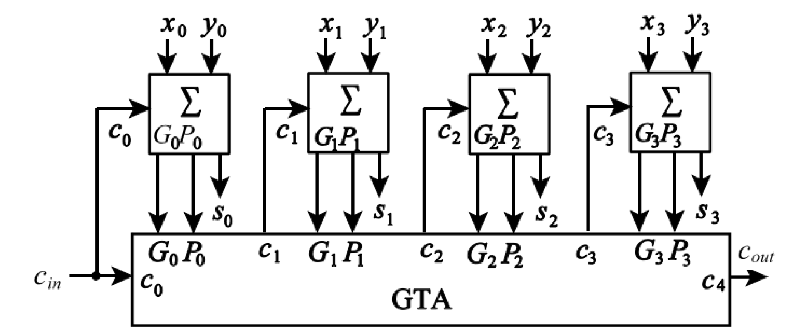
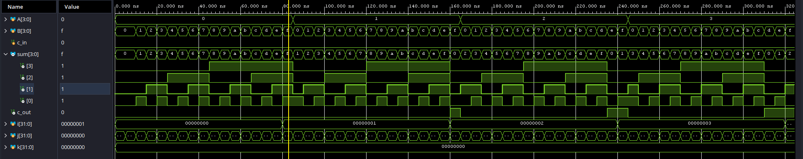

# Carry Lookahead Adder (CLA) - 4-bit

## Project Overview
This project features a high-performance 4-bit Carry Lookahead Adder (CLA) implemented in Verilog. Unlike standard ripple-carry adders, this design utilizes lookahead logic to minimize gate delay. The project emphasizes modular design, efficient gate-level optimization, and rigorous automated verification.

## Architecture & Design Decisions

### Gate-Level Optimization
Instead of using a standard XOR gate for the propagate ($P_k$) signal and the sum ($s_k$), this implementation uses a specific configuration of AND, OR, and NOR gates. 
* **Why AND/NOR instead of XOR:** On silicon, the combination of AND, OR, and NOR gates occupies less area and offers faster switching speeds than a standard XOR gate. We mathematically reconstructed the XOR function using $\overline{G_k \lor \overline{P_k}}$ to achieve the same logical result with higher hardware efficiency.

### Modular Design Strategy
The project is divided into three distinct modules to ensure scalability and maintainability:
* **`cla_1bit`**: The core computational cell.
* **`lookahead_generator`**: The "brain" that calculates carry signals in parallel.
* **`cla_4bit`**: The top-level module (motherboard) that handles interconnection.
* **Benefits:** This approach prevents code bloat, allows for easier unit testing, simplifies debugging, and enables clear visual tracking of signal flow across the hierarchy.

## Referenced Technical Documentation
The design logic and mathematical equations for the Carry Lookahead unit were derived from the following schematics and algebraic definitions:

## Verification Strategy
The design was verified using an exhaustive testbench that iterates through all $2^9$ (512) possible input combinations ($A - 4 bits, B - 4 bits, c_{in} - 1 bit$).

### AI-Assisted Verification
To maintain high efficiency and coding standards, the testbench infrastructure was generated with the assistance of AI (Gemini). The following prompt was used to ensure an accurate, modular, and self-checking testbench:

> "Act as a Verilog design engineer. Given the module:
> `module cla_4bit(input c_in, input [3:0] A, input [3:0] B, output [3:0] sum, output c_out);`
> Create a testbench that instantiates the module as 'TEST' using named port mapping. The testbench should:
> 1. Perform a manual reset of all ports ({A, B, c_in} = 0).
> 2. Use nested for-loops to iterate through all combinations of A, B, and c_in.
> 3. Monitor and display changes using $monitor, displaying A, B, c_in, sum, and c_out along with $time, separated by '|'.
> 4. Use a fixed delay of #50 between modifications.
> 5. Add a #500 delay at the end before $finish."

## Project Structure
| Folder/File | Description |
| :--- | :--- |
| `Design` | Contains `cla_1bit.v`, `lookahead_generator.v`, and `cla_4bit.v`. |
| `Testbench` | Contains the AI-generated `tb_cla_4bit.v`. |
| `guide_images` | Technical reference images for the CLA logic. |

## How to Run
1. Open Vivado Xilinx and create a new project.
2. Add the `.v` files from the `Design` and `Testbench` folders.
3. **Simulation Note:** Since this is an exhaustive test, ensure the simulation runtime is set to at least `3000ns` (Simulation Settings -> xsim.simulate.runtime).
4. Click `Run Simulation` and observe the Tcl Console for the real-time truth table output.

##Results

Because there are 512 possible combinations, Tcl-Console screenshots include only a few of them and waveforms includes one example of how to check the result(c_in = 0, A = 0, B = f => sum = f, c_out = 0)

