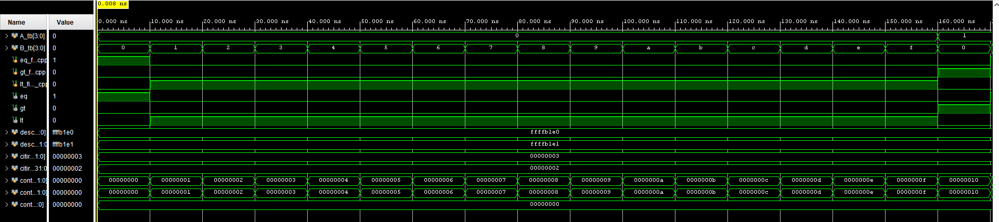
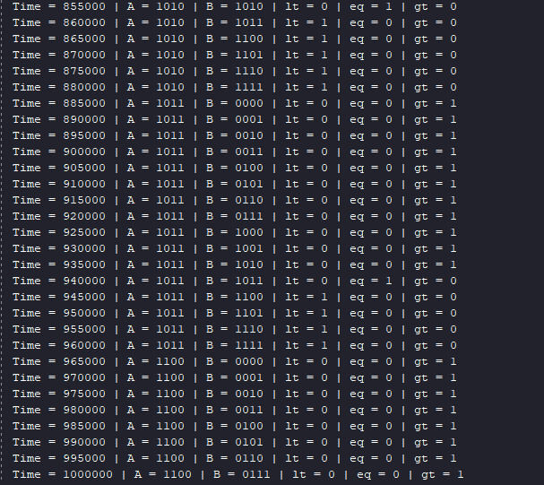

# 4-bit Magnitude Comparator

## Project Overview

This project features a structured 4-bit Magnitude Comparator designed in Verilog. The design focuses on a modular architecture, utilizing 1-bit comparator building blocks to achieve a scalable and efficient 4-bit implementation.

## Architecture & Design Decisions

### Modular Design Strategy

The project follows a hierarchical structure to enhance code readability and debugging:

* **`comparator_1bit`**: The fundamental comparison cell.
* **`comparator_4bits`**: The top-level module that handles bit-wise comparison logic and propagates the comparison results ($LT, EQ, GT$).
* **Benefits**: Modularizing the design prevents code complexity, facilitates unit testing for individual bits, and allows for easier maintenance.

## Verification Strategy

The design is verified using an exhaustive testbench that iterates through all 256 possible input combinations for 4-bit inputs ($A$ and $B$).

### AI-Assisted Verification

To maintain high efficiency and coding standards, the testbench infrastructure was generated with the assistance of AI (Gemini). The following prompt was used to ensure an accurate, modular, and self-checking testbench:

> "Act as a Verilog design engineer. Given the module:
> `module comparator_4bits(input [3:0] A, B, output lt, eq, gt);`
> Create a testbench that instantiates the module as 'TEST' using named port mapping. The testbench should:
>
> 1. Perform a manual reset of all ports ({A, B} = 0).
> 2. Use nested for-loops to iterate through all 256 combinations of A and B.
> 3. Monitor and display changes using $monitor, displaying A, B, lt, eq, and gt along with $time, separated by '|'.
> 4. Use a fixed delay of #5 between modifications."

## Project Structure

| Folder/File | Description |
| :--- | :--- |
| `Design` | Contains the Verilog source files (`comparator_1bit.v`, `comparator_4bits.v`). |
| `Testbench` | Contains the AI-generated `tb_comparator_4bits.v`. |

## How to Run

1. Open Vivado Xilinx and create a new project.
2. Add the `.v` files from the `Design` and `Testbench` folders.
3. Click `Run Simulation`.
4. Observe the Tcl Console for real-time truth table verification.

## Results

The testbench provides an automated output stream in the Tcl Console, verifying that every combination of A and B correctly triggers the `lt` (less than), `eq` (equal), or `gt` (greater than) flags.

