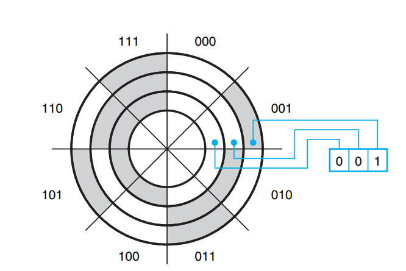
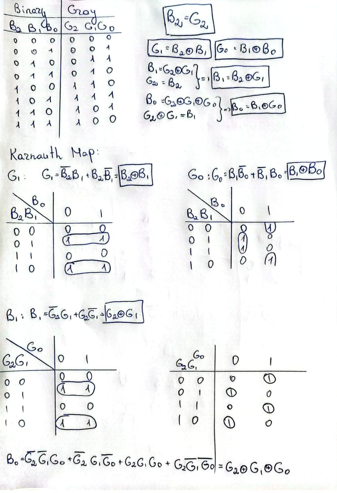
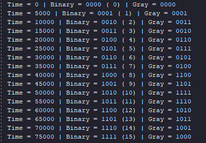
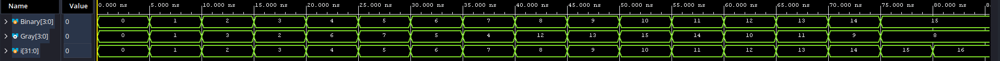
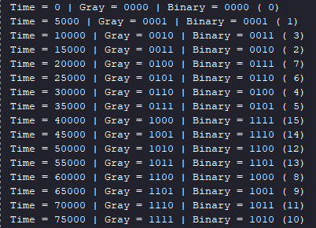
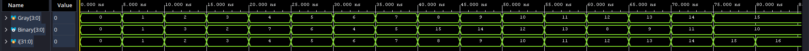

# Gray Code Converters (Binary <-> Gray)

## Theoretical Background: The Boundary Problem

The motivation for this module stems from a classic hardware problem described in John F. Wakerly's digital design literature regarding mechanical and optical encoders.

When an encoder reads boundaries between standard binary regions (e.g., transitioning from `001` to `010`), multiple encoded bits change simultaneously. If the reading mechanism is positioned right on the theoretical boundary, physical imperfections can cause the sensors to read an incorrect, transitional value (such as `011` or `000`). The most critical errors occur at boundaries where all bits change, such as the `011` to `100` transition.

**The Solution:** This hardware problem is solved by utilizing a digital sequence in which exactly *one bit* changes between each pair of successive code words. This is known as **Gray code**. Because only one bit toggles at each border, borderline readings reliably return either the old or the new value, completely eliminating intermediate glitches. This characteristic makes Gray code absolutely essential for safe Clock Domain Crossing (CDC) in architectures like Asynchronous FIFOs.

## Mathematical Proof & Logic Design

Instead of relying on empirical coding syntax, the gate-level architecture of these converters was rigorously derived by hand using **Karnaugh Maps**.

By applying the optimal boolean grouping rules studied in Digital Integrated Circuits (CID), the logic for the bit transitions was minimized to reveal inherent XOR patterns:

* **Binary to Gray (Encoder):** Results in a parallel architecture where each Gray bit is the XOR of the corresponding Binary bit and its more significant neighbor.
* **Gray to Binary (Decoder):** Results in a daisy-chain (cascade) architecture where each Binary bit relies on the XOR of the current Gray bit and the previously evaluated Binary bit.

## Project Structure

| Folder / File | Description |
| :--- | :--- |
| `Design/Binary_To_Gray.v` | The 4-bit Binary to Gray encoder (Parallel logic). |
| `Design/Gray_To_Binary.v` | The 4-bit Gray to Binary decoder (Cascaded logic). |
| `Testbench/Binary_To_Gray_tb.v` | Exhaustive simulation environment for the encoder. |
| `Testbench/Gray_To_Binary_tb.v` | Exhaustive simulation environment for the decoder. |
| `results/` | Contains the mathematical proofs and simulation waveforms. |
| `additional/` | Contains additional images for Wakerly disk example and Karnauth Map for Binary->Gray and Gray->Binary. |

## Verification

Both modules have been validated through testbenches that exhaustively iterate through all 16 possible 4-bit states, ensuring the physical RTL outputs perfectly match the theoretical truth tables.

## Testench for Binary->Gray

## Testench for Gray->Binary

