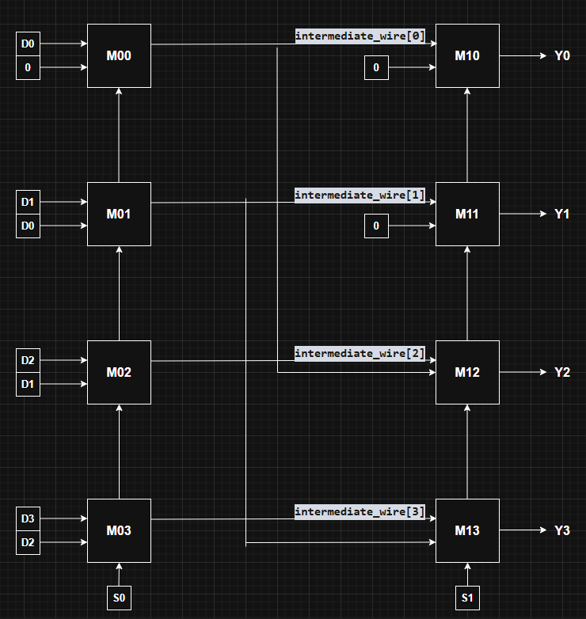
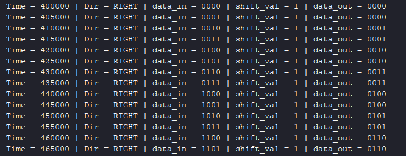
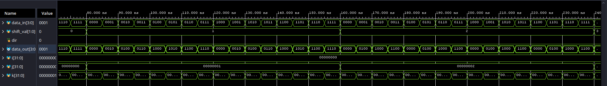

# 4-bit Bidirectional Logarithmic Logical Shifter

## Project Overview

This project features a structural 4-bit bidirectional logical shifter implemented in Verilog. The core architecture relies on a highly optimized **Logarithmic Shifter** (cascade) approach, using 2:1 Multiplexers. It focuses on hierarchical modular instantiation, physical wire routing, and clever hardware reuse to achieve both left and right shifts without deploying redundant logic gates.

## Literature Reference & Inspiration

The foundational architecture for this design was inspired by the "Datapath Subsystems" chapter in **"CMOS VLSI Design: A Circuits and Systems Perspective" by Neil Weste and David Harris**, as well as the Barrel Shifter optimizations detailed in **"Digital Design Principles and Practices" by John F. Wakerly**.

While classic "Flat" Barrel Shifters use massive N:1 multiplexers (which consume vast amounts of silicon and suffer from high parasitic capacitance), this project implements the mathematically elegant logarithmic cascade alternative. It reduces the component size to minimal 2:1 MUXes arranged in $\log_2(N)$ stages, heavily optimizing the routing and transistor count.

## Design Philosophy: Structural vs. Spaghetti Code

A common behavioral approach to writing a shifter in Verilog involves using the shift operators (`<<` or `>>`) inside an `always` block. While syntactically simple, this leaves the synthesis tool to guess the intended hardware, often resulting in sub-optimal logic block generation.

This project strictly enforces a **Structural Design Methodology**. The architecture is built from the ground up, starting with a custom `MUX_2_1` module. Instead of behavioral commands, the shifter relies on explicit module instantiations and precise physical wire routing. The design clearly distinguishes between structural control signals (vertical select lines) and data flow paths (horizontal/diagonal data lines).

---

## Hardware Architecture & Schematic

To shift a 4-bit number up to 3 positions, the design does not use 4 independent shift mechanisms. Instead, the shift value is broken down into its binary representation (powers of 2) and processed in successive stages.

As illustrated in the custom schematic above, the core relies on a two-stage multiplexer cascade:

* **Stage 0 (Controlled by S0):** Decides whether to shift the data by exactly **1 position** or pass it straight through. Notice the ground connection (`1'b0`) injected at the LSB position (`M00`) during a shift. This zero-padding is the defining hardware trait of a *logical* shifter.
* **Stage 1 (Controlled by S1):** Decides whether to shift the data by exactly **2 positions** or pass it straight through. The diagonal wiring routes data from two positions away (e.g., `M12` pulls data from the output of `M00`).

By cascading these stages, a binary command of `11` (decimal 3) will trigger both a 1-position shift and a 2-position shift, resulting mathematically in a perfect 3-position shift.

### The "Zero Hardware" Right Shift Trick

Instead of building a separate logarithmic matrix for right logical shifts (which would double the required silicon), this project exploits wire-routing at zero hardware cost. To shift right, the hardware performs three instantaneous steps using pure wire crossings:

1. **Pre-processing (Mirroring):** The input wires are physically reversed (bit-swapped).
2. **Core Operation:** The reversed data is passed through the standard Left Shifter core.
3. **Post-processing (Restoring):** The resulting output wires are physically reversed again to restore the original spatial meaning.

#### Trace Example: Logical Right Shift by 1 Position

To prove this structural trick works mathematically, let's trace a generic 4-bit input (`D3 D2 D1 D0`) undergoing a Right Shift by 1:

| Phase | Hardware Action | Internal Data State | Explanation |
| :--- | :--- | :--- | :--- |
| **0. Input** | None | `D3 D2 D1 D0` | The original data enters the Wrapper module. |
| **1. Mirror IN** | Wire cross-routing | `D0 D1 D2 D3` | Bit order is inverted. `D0` is now in the MSB position. |
| **2. Core Shift** | **Left** Shift by 1 | `D1 D2 D3  0` | The core applies its standard left shift. The data moves left, and a logical `0` (GND) is pulled into the LSB. |
| **3. Mirror OUT** | Wire cross-routing | `0 D3 D2 D1` | The output wires are inverted back to standard order. |

**The Result:** The final output is `0 D3 D2 D1`. By simply crossing the wires before and after the core, we achieved a perfect Logical Right Shift (with the correct `0` padding at the MSB position), without adding a single logic gate to the design!

## Truth Table

| S1 | S0 | Action (Positions) | Stage 0 (S0)    | Stage 1 (S1)    | Result (OUT)      |
|----|----|--------------------|-----------------|-----------------|-------------------|
| 0  | 0  | Shift by 0         | Pass direct     | Pass direct     | `D3 D2 D1 D0`     |
| 0  | 1  | Shift by 1         | Shift left by 1 | Pass direct     | `D2 D1 D0 0`      |
| 1  | 0  | Shift by 2         | Pass direct     | Shift left by 2 | `D1 D0 0  0`      |
| 1  | 1  | Shift by 3         | Shift left by 1 | Shift left by 2 | `D0 0  0  0`      |

## AI-Assisted Verification Strategy

To ensure rigorous testing, an exhaustive verification environment (Shifter_tb) was generated using AI. The model was prompted to create a "black-box" testbench to validate all permutations of inputs, shift amounts, and directions.

The exact prompt utilized for generation was:

"I want you to act as a design engineer. Create a high-quality testbench for a "black-box" module named top_shifter_4bit. The ports are: input [3:0] data_in, input [1:0] shift_val, input dir, output [3:0] data_out.
Instantiation must be done by name. Initialize variables to 0. Generate a $monitor task to display time, dir (String: 'LEFT' or 'RIGHT'), data_in (binary), shift_val (decimal), and data_out (binary). Iterate through all possible combinations of data_in, shift_val, and dir using nested loops. Add a delay of #5 between modifications and a final #500 delay before $finish."

## Project Structure

| Folder/File | Description |
| :--- | :--- |
| `Design` | Contains the top wrapper `MUX_2_1.v`, `Log_Shifter_Left_4bits.v` and `top_shifter_4bits.v` |
| `Testbench` | Contains the AI-generated exhaustive simulation environment `Shifter_tb.v`. |
| `results` | Waveform and console output evidence. |
| `guide_waveforms` | Image with guidance on how to change waveform result from hexa to decimal. |

## Final Notes

By default, hardware simulators may display bus values in Hexadecimal. To verify the bit-level shifting visually, it is highly recommended to change the waveform display radix for data_in and data_out to Binary. If you are unsure how to correctly import these dependencies, please consult the instructional screenshots provided in the guide_images folder.

## Results

