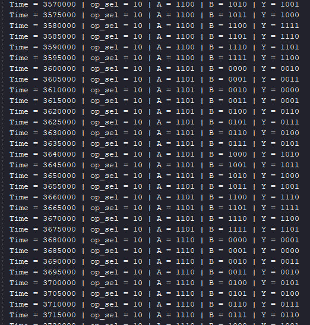
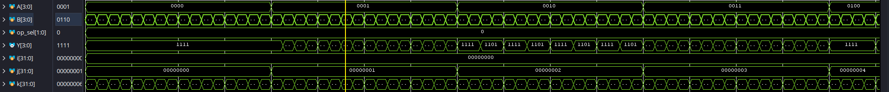

# 4-bit Bitwise Logic Unit

## Project Overview

This project implements a 4-bit Logic Unit, the essential component representing the "L" in an Arithmetic Logic Unit (ALU). The module performs bitwise operations on two 4-bit input buses (`A` and `B`) based on a 2-bit selection signal (`op_sel`), calculating the result instantaneously using pure combinational logic.

## Architecture and Transistor-Level Optimization

Unlike standard educational implementations that use classic AND, OR, and XOR gates, this architecture was intentionally optimized for CMOS technology by exclusively utilizing inverse logic functions: **NAND**, **NOR**, **XNOR**, and **NOT**.

This architectural decision is grounded in the fundamental principles of digital integrated circuits:

* In CMOS technology, a **NAND** or **NOR** gate is a native structure built from just 4 transistors.
* An AND gate physically requires a NAND gate followed by an inverter, thus consuming 6 transistors (a 50% increase in silicon area).
* By choosing a direct implementation via inverse gates, the design significantly reduces the total transistor count required during physical synthesis, lowers static power consumption, and minimizes propagation delay.

From a Register-Transfer Level (RTL) perspective, routing the final result to the output is handled by a combinational block using a `case` statement. This method allows the synthesizer to automatically infer a 4:1 multiplexer, covering all states (including the `default` case) to strictly prevent the accidental generation of Latch memories.

---

## Project Structure

| Folder / File | Description |
| :--- | :--- |
| `Design/` | Contains the main source file `Logic_4bit.v`. |
| `Testbench/` | Contains the simulation environment `Logic_4bit_tb.v`. |
| `results/` | Images of the waveforms and simulator console output. |

---

## AI-Assisted Verification Strategy

To guarantee the functional correctness of the module, an exhaustive testbench was generated using AI assistance. The testing environment instantiates the module as a "black-box" and utilizes nested `for` loops to automatically iterate through absolutely all possible input combinations.

Since the design processes two 4-bit data buses and a 2-bit selection signal, the testbench validates a total of $2^4 \times 2^4 \times 2^2 = 1024$ unique test vectors, printing the results directly into the Tcl console for rapid visual inspection.

## Note

Because there are 1024 possible combinations of `A`, `B` and `op_sel`, to see all the outputs it is recomended to extend simulation time to 1024*5 + 500 = 5620ns. Instructions with changing simulation time can be found in `simulation_time_guide` folder. Also for waveforms it is recomended to change the Radix of `A`, `B` inputs and `Y` output to binary. Instructions with changing Radix can be found in `waveform_guide` folder.

---

## Results and Verification

