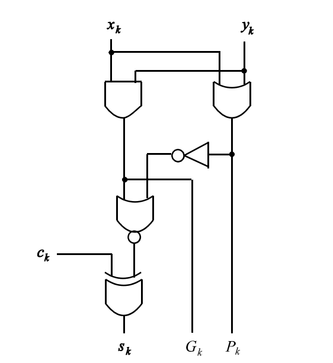
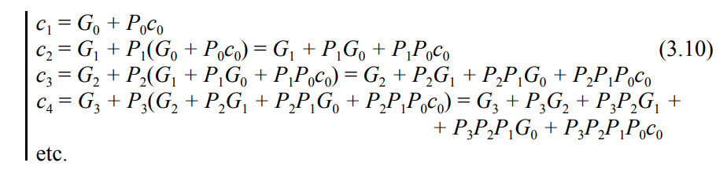
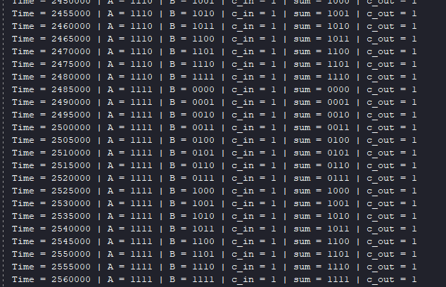
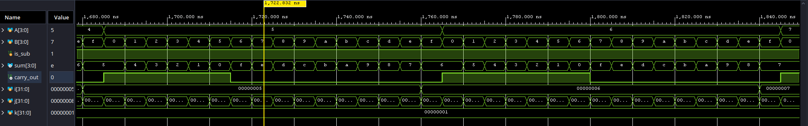
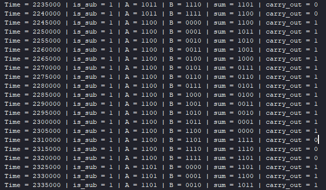

# 4-bit Carry Lookahead Adder/Subtractor (CLA)

## Project Overview

This project features a high-performance 4-bit Carry Lookahead Adder/Subtractor implemented in Verilog. Unlike standard ripple-carry adders, the core arithmetic unit utilizes lookahead logic to minimize gate delay. The project emphasizes modular design, efficient gate-level optimization, hardware reuse for subtraction, and rigorous automated verification.

## Architecture & Design Decisions

### 1. Subtraction via 2's Complement & XOR Efficiency

Instead of instantiating a completely separate hardware block for subtraction (which would waste valuable silicon area), this design reuses the pre-validated CLA core. Subtraction is achieved using 2's complement mathematics based on the principle:
$$A - B = A + (-B) = A + \overline{B} + 1$$

To implement this without adding delay to the critical path, a single control signal, `is_sub` (0 for addition, 1 for subtraction), serves a dual purpose:

* **Conditional Inverter (XOR Gates):** The $B$ input is passed through an array of XOR gates alongside `is_sub`. When `is_sub = 1`, the XOR acts as a NOT gate, providing the 1's complement ($\overline{B}$). When `is_sub = 0`, $B$ passes unchanged.
* **Automatic Carry-In (+1):** The `is_sub` signal is physically routed into the $c_{in}$ port of the adder. For subtraction, this automatically injects the $+ 1$ required for the 2's complement conversion exactly when needed.

### 2. Flag Handling: Carry vs. Borrow (ARM-Style)

In this implementation, the `carry_out` signal is passed directly from the core adder to the top level. It is crucial to understand that during a subtraction operation, **a generated carry out is the exact inverse of a borrow out** ($Borrow_{out} = \overline{c_{out}}$).

This project intentionally follows a hardware-minimalist approach (similar to ARM architectures), leaving the flag "as is" rather than adding an extra XOR gate to invert it at the arithmetic level. The processor's Status Register or software is expected to interpret this flag.

* **Addition (`is_sub = 0`):** `carry_out = 1` means an overflow/carry occurred.
* **Subtraction (`is_sub = 1`):** `carry_out = 0` means a **borrow occurred** ($A < B$), while `carry_out = 1` means no borrow was needed ($A \ge B$).

> **Concrete Subtraction Example ($3 - 5$):**
> Let $A = 3$ (`0011`) and $B = 5$ (`0101`). We want to calculate $3 - 5$.
>
> 1. $\overline{B}$ (inverted via XOR) = `1010`
> 2. Add $1$ (via $c_{in}$) = `1011` (this is $-5$ in 2's complement)
> 3. The adder computes: `0011` + `1011` = **`0 1110`**
>
> * **Result:** `1110` (which is $-2$ in 2's complement, mathematically correct).
> * **Flag:** The extra bit is $c_{out} = 0$. Since $c_{out}$ is $0$ during subtraction, it correctly signals that a **borrow occurred**.

### 3. Gate-Level Optimization

Instead of using a standard XOR gate for the propagate ($P_k$) signal and the sum ($s_k$), the core cell uses a specific configuration of AND, OR, and NOR gates.

* **Why AND/NOR instead of XOR:** On silicon, the combination of AND, OR, and NOR gates occupies less area and offers faster switching speeds than a standard XOR gate. We mathematically reconstructed the XOR function using $\overline{G_k \lor \overline{P_k}}$ to achieve the same logical result with higher hardware efficiency.

### 4. Modular Design Strategy

The project is divided into distinct modules to ensure scalability and maintainability:

* **`cla_1bit`**: The core computational cell.
* **`lookahead_generator`**: The "brain" that calculates carry signals in parallel.
* **`cla_4bit`**: The core adder module that handles interconnection.
* **`add_sub_4bit`**: The top-level wrapper managing the `is_sub` logic and data preprocessing.

## Referenced Technical Documentation

The design logic and mathematical equations for the Carry Lookahead unit were derived from the following schematics and algebraic definitions:

## Verification Strategy

The design was verified using an exhaustive testbench that iterates through all $2^9$ (512) possible input combinations ($A - 4 bits, B - 4 bits, is\_sub - 1 bit$).

### AI-Assisted Verification

To maintain high efficiency and coding standards, the testbench infrastructure was generated with the assistance of AI (Gemini). The testbench:

1. Performs a manual reset of all ports.
2. Uses nested for-loops to iterate through all states of Addition and Subtraction for every possible $A$ and $B$ value.
3. Monitors and logs changes using `$monitor` with a structured layout.
4. Uses a fixed delay of `#5` between modifications and a `#500` delay before `$finish` to safely observe edge cases.

## Project Structure

| Folder/File | Description |
| :--- | :--- |
| `Design` | Contains the top wrapper `add_sub_4bit.v` and the core components (`cla_1bit.v`, `lookahead_generator.v`, `cla_4bit.v`). |
| `Testbench` | Contains the exhaustive simulation environment `tb_add_sub_4bit.v`. |
| `guide_images` | Technical reference images for the CLA logic. |
| `results` | Waveform and console output evidence. |
| `Run_to_time_guide` | Images with guidance regarding simulation time. |

## How to Run

1. Open Vivado Xilinx and create a new project.
2. Add the `.v` files from the `Design` and `Testbench` folders.
3. **Simulation Note:** Since this is an exhaustive test, ensure the simulation runtime is set to at least `2560ns` (Simulation Settings -> xsim.simulate.runtime) to accommodate the 512 iterations with `#5` delays.
4. Click `Run Simulation` and observe the Tcl Console for the real-time truth table output.

## Results

Because there are 512 possible combinations, Tcl-Console screenshots include only a few of them and waveforms include specific examples of how to check the results for both addition and subtraction.

* Note: Because there are 512 combinations for A , B , is_sub, 1000ns Run to time won't be enough. To extend the simulation time, open `Run_to_time_guide` folder for instructions.

## Waveforms and Tcl-Console for SUM

## Waveforms and Tcl for DIF

### Explication

Let's take two examples:

1) A > B: A = 1100 | B = 0010 <=> A = 12 | B = 2 => A - B = 10 = 1010 | carry_out = 1 -> There is no borrow

2) A < B: A = 1100 | B = 1110 => (-B) = 0010 | A + (-B) = 1110 = 14 = e| carry_out = 0 -> There is borrow

Similar for waveforms:

* A = 5 = 0101 | B = 7 = 0111 => (-B) = 1001 | A + (-B) = 1110 = 14 = e | carry_out = 0 -> There is borrow

To read a negative 2's complement result (like finding out what `1110` means):

* Invert all the bits (1's complement: 1 -> 0 ; 0 -> 1)
* Add +0001 to the result to get the absolute magnitude

* Ex: To verify that 1110 represents -2 in decimal:
  1110 -> 0001 (inverted) -> + 0001 = 0010 (which is 2 in decimal).
  Since the original sign bit was 1, the value is confirmed to be -2.
