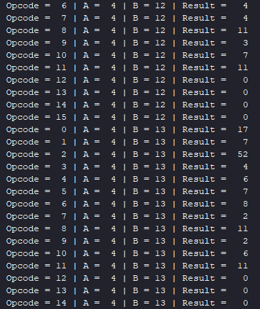
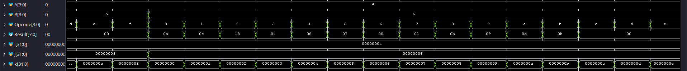

# 4-bit ALU (Arithmetic Logic Unit)

This project implements a 4-bit ALU that brings together, under a single structural "wrapper," several modules already developed and documented separately in this repository (each with its own README): a carry-lookahead adder/subtractor, a carry-lookahead multiplier, a comparator, a logic unit, a left/right barrel shifter, and binary↔Gray converters.

## General architecture

The ALU is implemented **structurally**, not behaviorally: instead of one giant `case` statement that computes everything with Verilog operators (`+`, `*`, `<<`, etc.), the `ALU_Design` module instantiates each functional block as a separate sub-module, and all sub-modules run **in parallel**, regardless of the Opcode. At the end, a single `case` inside the `always` block selects *which of the already-computed results* gets routed to the `Result` output port.

```
        ┌─────────────────────┐
        │   Top_Multiplier     │──► multiplier_result (8 bits)
        ├─────────────────────┤
        │  comparator_4bits    │──► lt, eq, gt
        ├─────────────────────┤
 A ────►│  Binary_To_Gray       │──► binary_gray_result
 B ────►│  Gray_To_Binary       │──► gray_binary_result
        ├─────────────────────┤
        │  top_shifter_4bit     │──► shifter_result
        ├─────────────────────┤
        │  Logic_4bit           │──► logic_result
        ├─────────────────────┤
        │  add_sub_4bit         │──► sum_dif_result, carry_out
        └─────────────────────┘
                  │
                  ▼
        MUX (case on Opcode) ──► Result[7:0]
```

This style has a clear speed advantage (all blocks work simultaneously, with no selection latency *before* computation), at the cost of larger silicon area — every block consumes resources even when its result isn't used in the current cycle. This is exactly the classic *speed vs. area* trade-off discussed in each module's individual project as well.

## Operation code (Opcode) map

| Opcode | Operation | Module used | Notes |
|---|---|---|---|
| `0000` | A + B | `add_sub_4bit` (is_sub=0) | `Result = {3'b000, carry_out, sum}` |
| `0001` | A − B | `add_sub_4bit` (is_sub=1) | subtraction via two's complement; `carry_out` becomes a "not-borrow" flag |
| `0010` | A × B | `Top_Multiplier` | 8-bit result (4+4), no truncation |
| `0011` | Comparison A vs B | `comparator_4bits` | `Result = {00000, lt, eq, gt}` |
| `0100` | Binary → Gray (from A) | `Binary_To_Gray` | |
| `0101` | Gray → Binary (from A) | `Gray_To_Binary` | |
| `0110` | Left shift (A << B[1:0]) | `top_shifter_4bit` | |
| `0111` | Right shift (A >> B[1:0]) | `top_shifter_4bit` | `dir` derived from Opcode |
| `1000`–`1011` | AND / OR / NAND / NOR etc. | `Logic_4bit` | selection via `Opcode[1:0]` |
| others | — | — | `Result = 0` (default) |

Note that for shifting, the direction signal `shift_dir` is derived directly from the Opcode (`(Opcode == 4'b0111) ? 1 : 0`), and for basic arithmetic the `is_sub` bit is simply `Opcode[0]` — a typical structural-design technique where individual bits of the operation code directly drive internal selection signals, without any extra decoding logic.

## About the testbench and the results

The testbench (exhaustively generated, following a methodology similar to the one described in the multiplier project) sweeps through **every possible combination** of A (0–15), B (0–15), and Opcode (0–15) — 4096 cases in total — and prints, for each one, Opcode, A, B, and Result in decimal.

The results are consistent with the specification above for all 12 defined operations (`0000`–`1011`), and for Opcode `1100`–`1111` (undefined), Result is correctly `0`, as expected from the `default` branch.

### A common point of confusion: subtraction with A = B (e.g., A=0, B=0, Opcode=0001 → Result = 16)

At first glance this looks like an error (you'd expect `Result = 0`), but it is actually the **correct** behavior of a subtractor implemented via two's complement on top of an adder (CLA): subtraction A − B is computed as `A + (~B) + 1`.

For A = 0, B = 0:

```
A + (~B + 1) = 0000 + (1111 + 1) = 0000 + 10000 = 10000
```

The lower 4 bits of the result are `0000`, but a **carry_out = 1** is produced. The ALU code builds `Result = {3'b000, carry_out, sum} = {1, 0000} = 10000₂ = 16`.

Important: when subtraction is implemented this way, the meaning of `carry_out` flips compared to addition — it becomes a **"not-borrow"** flag:

- `carry_out = 1` → A ≥ B → the subtraction did not require a borrow,
- `carry_out = 0` → A < B → a borrow was required.

This checks out perfectly throughout the rest of the table: for example, A=0, B=1, Opcode=0001 (0−1, so A<B) gives `Result = 15 = {0, 1111}` — carry_out=0 (borrow), and the lower 4 bits `1111` correctly represent `−1` in 4-bit two's complement. So **there is no design error**; `Result` simply packs both the subtraction result (lower bits) and the inverted borrow flag (bit 4), exactly as real ALUs do (see the inverted-carry convention used for the `C` flag on `SUB` instructions in x86/ARM architectures).

## Project structure

| Folder/File | Description |
|---|---|
| `Design` | All ALU sub-modules (multiplier, comparator, shifter, logic unit, adder/subtractor, Gray converters) + each module's individual testbench |
| `ALU_Design.v` | The structural wrapper module that brings all blocks together under a single Opcode |
| `ALU_Testbench.v` | The exhaustive testbench for the ALU (4096 A/B/Opcode combinations) |
| `results` | Contains the images of TCL Console and waverofms |

## How to run

1. Open Vivado and create a new project.
2. Add all design files from `Design` (including the individual sub-modules for the multiplier, shifter, comparator, logic unit, adder/subtractor, and Gray converters), plus `ALU_Design.v`.
3. Add `ALU_Testbench.v` as the simulation file.
4. Set the simulation runtime long enough to cover all 4096 combinations (depending on the delay used between iterations in the testbench).
5. Run the simulation and check the Tcl console for the full truth table, or the waveform viewer — decimal display is recommended for readability.

## Results




*Note: Because there are $16^3$ possible combinations of A, B, Opcode with 5ns delays, the total time needed for the simulation is 20480ns.*

## Conclusion

This ALU demonstrates how independently developed and verified modules can be combined into a single structural architecture, controlled by a single operation code, without sacrificing design clarity or performance (all blocks compute in parallel). The testbench results confirm the correctness of every operation, including the arithmetic quirks specific to two's-complement subtraction.
